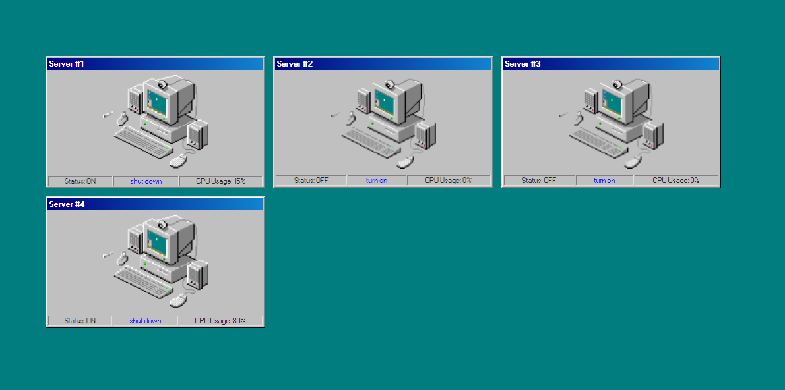
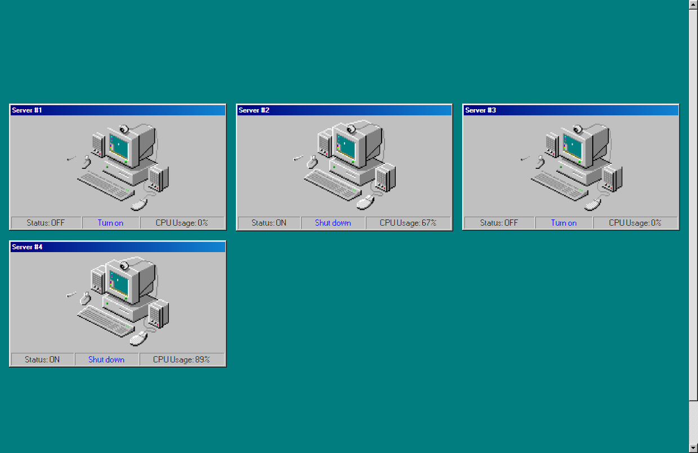
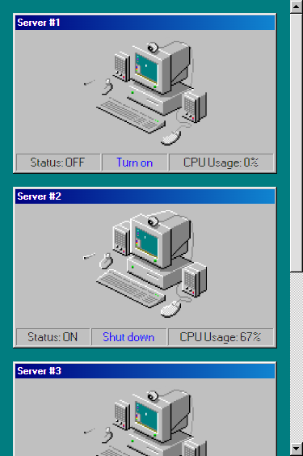

# Innovid challenge: Load balancer
Tenemos que crear una aplicación que muestre la carga de nuestros servidores 1, 2, 3 y 4, lamentablemente nuestro backend no tiene implementado un método para obtenerlos todos al mismo tiempo así que hay que traerlos de a uno, en paralelo.

## API
* GET https://localhost:8000/status/:id -> Obtiene la carga de un servidor

> El código de la API no debe ser modificado.

## Frontend
* Debe mostrar la carga de los cuatro servidores.
* La carga se debe actualizar cada 5 segundos.
* Puedo prender y apagar servidores (dejo de traerme su carga).

> TODO el código de la aplicación frontend puede ser modificado.
> El proyecto incluye SASS y [98.css](https://jdan.github.io/98.css) para usar a disposición, los assets se encuentran en la carpeta `assets` dentro del proyecto del cliente.



## Corriendo el proyecto
```bash
# Instalar dependencias del proyecto
npm install

# Correr el servidor de desarrollo
npm dev
```

## Modalidad de entrega
* Repositorio público subido a GitHub, Gitlab, Bitbucket.

# Solution

### Desktop View



### Mobile View



### Link

- [Live site](https://innovid-challenge.vercel.app/)

### Built with

<p>
 <a href="https://www.typescriptlang.org/">
  
 </a>
  <a href="https://sass-lang.com/">
  
 </a>
  <a href="https://react.dev/blog/2023/03/16/introducing-react-dev">
  
 </a>
  <a href="https://vitejs.dev/">
  
 </a>
</p>

## Run the project locally

1. Clone this repository

2. Install dependencies

  ```sh
   npm install
   ```

3. Start the local server

  ```sh
   npm run dev
   ```

4. Open http://localhost:5173/ in your browser
